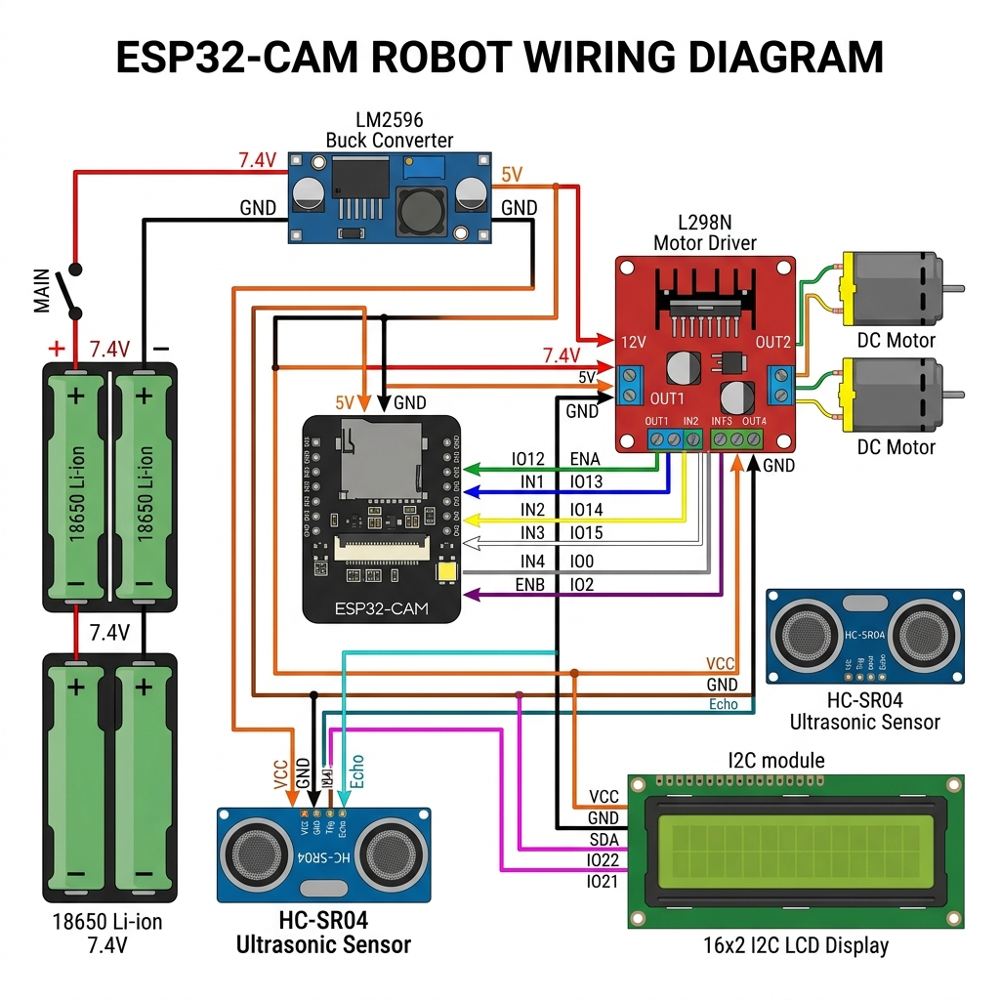
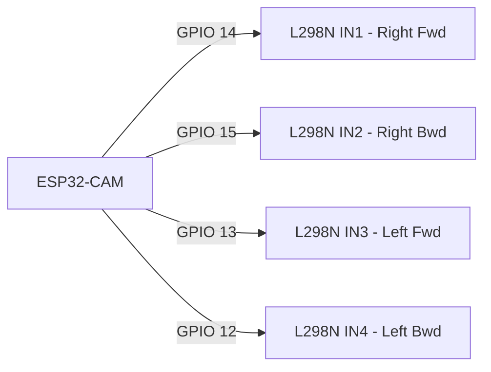

# 🛠️ Winky AI Robot: Ultimate Wiring Guide (Beginner Friendly)

This guide is designed to help you wire your Winky AI Robot even when you are offline. Follow these steps carefully to ensure a safe and functional build.

---

## 📸 Master Visual Schematic

---

## ⚡ Step 1: The Power System (CRITICAL)
Before connecting any data wires, you must set up the power correctly. Incorrect voltage will permanently damage the ESP32-CAM.

### **The Buck Converter Setup**
1.  Connect the **18650 Battery Holder** (7.4V) to the **IN+** and **IN-** terminals of the **LM2596 Buck Converter**.
2.  Use a multimeter to measure the output at **OUT+** and **OUT-**.
3.  Turn the small brass screw on the blue potentiometer until the output reads **exactly 5.0V**.
4.  **DO NOT** connect the ESP32 until this is verified.

### **Power Distribution Table**
| From Component | Terminal | To Component | Terminal | Wire Color (Recommended) |
| :--- | :--- | :--- | :--- | :--- |
| Battery (+) | Red Wire | L298N | 12V Terminal | Red |
| Battery (+) | Red Wire | Buck Converter | IN+ | Red |
| Battery (-) | Black Wire | L298N | GND Terminal | Black |
| Battery (-) | Black Wire | Buck Converter | IN- | Black |
| Buck Converter | OUT+ (5V) | ESP32-CAM | 5V Pin | Orange |
| Buck Converter | OUT- (GND) | ESP32-CAM | GND Pin | Black |

---

## 🧠 Step 2: The Brain & Muscles (Motors)
The ESP32-CAM sends "Logic Signals" to the L298N to tell the motors which way to turn.

### **Motor Logic Connections**

| ESP32 Pin | L298N Terminal | Function |
| :--- | :--- | :--- |
| **GPIO 14** | IN1 | Right Motor Forward |
| **GPIO 15** | IN2 | Right Motor Backward |
| **GPIO 13** | IN3 | Left Motor Forward |
| **GPIO 12** | IN4 | Left Motor Backward |

---

## 👁️ Step 3: Sensors & Visuals (I2C & Ultrasonic)
These components allow Winky to "see" and "talk" (via the screen).

### **HC-SR04 Ultrasonic Sensor (The Eyes)**
*   **VCC** $\rightarrow$ Connect to **5V** (Buck Converter Output)
*   **GND** $\rightarrow$ Connect to **Common Ground**
*   **TRIG** $\rightarrow$ Connect to **GPIO 2**
*   **ECHO** $\rightarrow$ Connect to **GPIO 16**

### **16x2 LCD Display (The Mouth/Face)**
*   **VCC** $\rightarrow$ Connect to **5V**
*   **GND** $\rightarrow$ Connect to **Common Ground**
*   **SDA** $\rightarrow$ Connect to **GPIO 4**
*   **SCL** $\rightarrow$ Connect to **GPIO 33**

---

## ⚠️ Safety Checklist for Beginners
- [ ] **Common Ground:** Are ALL ground (GND) wires connected together? (Battery, ESP32, L298N, Buck Converter).
- [ ] **Voltage Check:** Did you measure 5V from the Buck Converter before plugging in the ESP32?
- [ ] **No USB + Battery:** Never plug in the FTDI/USB programmer while the battery power is ON.
- [ ] **Loose Strands:** Ensure no copper strands are touching adjacent pins.

---
**Pro Tip:** If your robot moves backward when it should move forward, simply swap the two wires going from the L298N to that specific motor.
